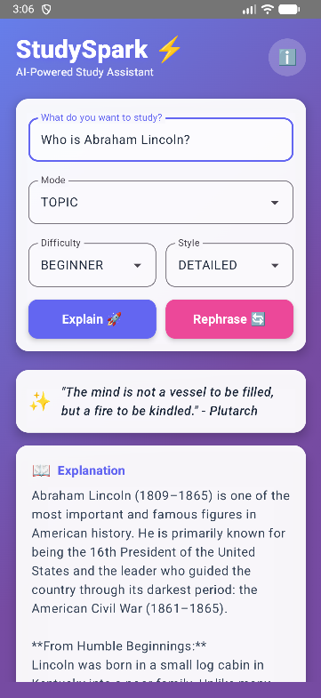
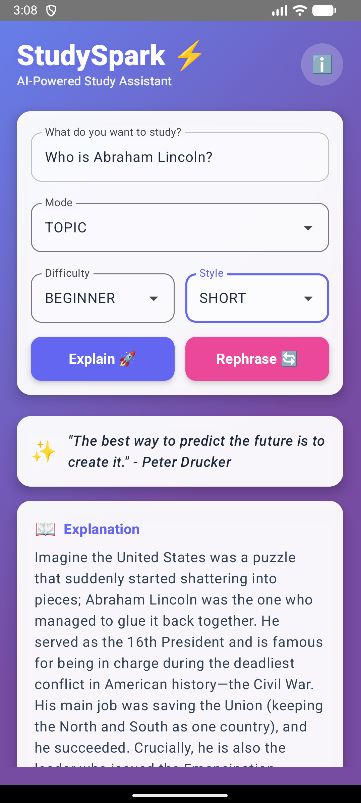
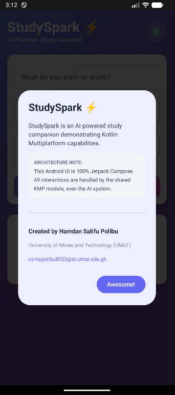

# ⚡ StudySpark

**AI-Powered Study Companion built with Kotlin Multiplatform**

> One shared intelligence. Multiple platforms. Zero duplicated logic.

## 🎥 Demo Video

[](https://youtu.be/CI6pAQ2FviA)

## 📱 Android App Screenshots

<p align="center">
  
  
  
</p>

<p align="center">
  
  
</p>

## 📘 Project Overview

StudySpark is an AI-powered study companion designed to help students understand complex topics faster and study more effectively. It acts as a second brain that can explain concepts, summarize notes, generate quizzes, and create interactive flashcards on demand.

### The Core Idea

Instead of building separate AI systems for each platform, StudySpark uses a single **Kotlin Multiplatform (KMP)** shared module to power all intelligence.
This ensures consistent behavior, reduced bugs, and maximum code reuse across platforms.

## 🌍 Platform Availability

| Platform | Status | Technology |
|----------|--------|------------|
| **Web** | ✅ Live | Kotlin/JS + Glassmorphism CSS |
| **Android** | ✅ Live | Jetpack Compose + Material 3 |
| **iOS** | 🔜 Ready | (Shared module is compatible) |

## � Demo Video

[](https://youtu.be/CI6pAQ2FviA)

## 📱 Android App Screenshots

<p align="center">
  
  
  
</p>

<p align="center">
  
  
</p>

## �🏗 Architecture & Technical Details

The heart of StudySpark is the `:shared` Kotlin Multiplatform module, which contains all core business logic and AI orchestration.

### 1. Shared Module (`:shared`) — The Brain
*   **Prompt Engineering**: Dynamically constructs AI prompts based on topic, pasted text, difficulty level, and learning style.
*   **AI Integration**: Handles all communication with the **Google Gemini 1.5 Flash** model.
*   **Networking**: Uses **Ktor Client** with ContentNegotiation for JSON processing.
*   **Response Parsing**: Extracts structured data (explanations, quizzes, flashcards) from unstructured LLM responses.
*   **Safety & Validation**: Validates inputs and gracefully handles API errors and rate limits.
*   **Secure Architecture**: Implements `StudyEngineFactory` with `expect/actual` mechanism to resolve keys safely from the environment or fallback to **Mock Mode**.

### 2. Android App (`:androidApp`)
*   **UI Framework**: 100% **Jetpack Compose** (Material 3).
*   **Theming**: Custom Material 3 theme with a violet/indigo gradient aesthetic.
*   **State Management**: Android `ViewModel` managing `UiState` (Loading, Success, Error).
*   **Architecture**: Thin UI layer — the Android app contains **no business logic** and relies entirely on the shared module.
*   **Features**: Interactive flashcards, quizzes, summaries, and an About dialog.

### 3. Web App (`:webApp`)
*   **Language**: **Kotlin/JS**.
*   **Styling**: Hand-crafted CSS using Glassmorphism principles.
*   **Interaction Model**: Direct DOM manipulation via Kotlin.

---

## ✨ Key Features

1.  **AI Topic Explanation**: Enter any topic (e.g., "Quantum Physics") and get a structured breakdown.
2.  **Smart Flashcards**: Auto-generated Q&A cards with interactive "click-to-flip" animations.
3.  **Quiz Generation**: 3-question mini-quizzes to test your understanding immediately.
4.  **Text Summarizer**: Paste your lecture notes to get a summary + study aids.
5.  **Motivational Quotes**: AI-attributed quotes from historical figures start every session.
6.  **Customizable Learning**:
    *   **Modes**: Topic vs. Text Paste.
    *   **Difficulty**: Beginner, Intermediate, Advanced.
    *   **Style**: Short & Sweet vs. Detailed.

## 🛠 Tech Stack

*   **Language**: Kotlin (1.9.21)
*   **Build System**: Gradle 8.5 (Kotlin DSL)
*   **Multiplatform**: Kotlin Multiplatform (KMP)
*   **UI (Android)**: Jetpack Compose + Material 3
*   **UI (Web)**: Kotlin/JS + CSS3
*   **Networking**: Ktor Client (2.3.7)
*   **Serialization**: Kotlinx Serialization
*   **Concurrency**: Kotlin Coroutines
*   **AI Model**: Google Gemini 1.5 Flash

## 🚀 How to Run

### Prerequisites
*   JDK 17 or higher
*   Android Studio Iguana (or newer) for Android Emulator

### Option 1: Web App
1.  Run the Gradle task:
    ```bash
    ./gradlew :webApp:jsBrowserDevelopmentRun
    ```
    *(Windows: use `gradlew.bat`)*
2.  Open `http://localhost:8080` in Chrome/Firefox.

### Option 2: Android App
1.  Ensure an Android Emulator is running (API 34+ recommended).
2.  Install and launch:
    ```bash
    ./gradlew :androidApp:installDebug
    adb shell am start -n com.studyspark.android/.MainActivity
    ```
    *Or simply open the project in Android Studio and press **Run**.*

### 🔐 Security & AI Modes

**Default: Mock Mode (Safe)**
If no API key is provided, the app runs in **Mock Mode**, returning realistic sample data. This allows judges to test the UI and flow without needing an API key.

**Optional: Real AI Mode**
To enable the live Gemini 1.5 Flash integration:

1.  **Web App**: Append `?key=YOUR_API_KEY` to the URL.
2.  **Android App**: Set the `GEMINI_API_KEY` environment variable on your machine.
    *   **Windows**: `setx GEMINI_API_KEY "your_key"`
    *   **macOS/Linux**: `export GEMINI_API_KEY="your_key"`
    *(Note: Restart Android Studio/Emulator after setting env vars)*

## ✅ Contest Compliance

*   ✅ **Kotlin Multiplatform**: Core logic fully shared.
*   ✅ **Platforms**: Web (Kotlin/JS) and Android (Compose) fully implemented.
*   ✅ **Original Work**: Built specifically for the Kotlin Multiplatform Contest.
*   ✅ **AI-Driven**: AI is the core functional driver.
*   ✅ **Code Re-Use**: 100% of business logic is in `:shared`.

## 👨‍💻 Credits

*   **Developer**: Hamdan Salifu Polibu
*   **Institution**: University of Mines and Technology (UMaT), Ghana
*   **Contact**: +233 599 545 544
*   **Email**: ce-hspolibu8923@st.umat.edu.gh
